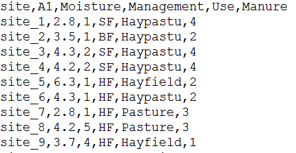

Introduction  to the tidyverse
========================================================
author: Eric Pedersen and Keith Lewis
date: September 28, 2017
autosize: true
width: 1440
height: 900
<div align="center">

</div>


Getting started 
========================================================

Before we go:

1. Have you got R installed? 
2. Were you able to download the scripts and data we sent?
3. Does the following code run without errors? 


```r
# setwd("c:/where_the_folder_is/")

library(readr)
library(tidyr)
library(dplyr)

file.exists("data/dune.csv")
file.exists("data/dune.env.csv")
file.exists("data/trawl_abiotic.csv")
file.exists("data/trawl_biomass.csv")
```

What we'll cover today
========================================================

- What is tidy data, and what is the tidyverse?
- loading data with `readr`
- switching between different ways of representing data with `tidyr`
- manipulating data with `dplyr`

What is tidy data? 
========================================================
incremental: true
Data organized into tables where:


### 1. Every column is a different variable

### 2. Every row is a single observation

### 3. Each type of observation is in its own table


What is tidy data? 
========================================================
incremental: true
### Untidy data

```
  day M_1cm M_5cm F_1cm F_5cm
1   1   0.5   1.2   0.4     2
2   2   0.8   1.5   0.6     3
```


### Tidy data

```
  day sex length weigth
1   1   M      1    0.5
2   2   M      5    0.8
3   1   F      1    1.2
4   2   F      5    1.5
5   1   M      1    0.4
6   2   M      5    0.6
7   1   F      1    2.0
8   2   F      5    3.0
```


Question:
==============================================

What would be needed to make this data set tidy?


```
 year eggs_200m juv_200m eggs_500m juv_500m
 2005        10       20        20        2
 2007        20        4         0        1
 2009         2       12        37        4
```


What is the Tidyverse?
========================================================
incremental: true 

* R packages for working with tidy data
* Workflow based on functions that:
  * Are all simple verbs that do one thing (arrange, mutate, summarize, etc.)
  * Take a data frame as their first argument
  * Let you refer to the columns in that data frame by name
  * Return a data frame
  * **Play well with each other**


What is the Tidyverse?
========================================================
incremental: true


 

(although Hadley $\ne$ tidyverse)


The basic idea
========================
incremental: true


```r
head(CO2,n=3)
```

```
  Plant   Type  Treatment conc uptake
1   Qn1 Quebec nonchilled   95   16.0
2   Qn1 Quebec nonchilled  175   30.4
3   Qn1 Quebec nonchilled  250   34.8
```


```r
CO2_lowconc = filter(CO2, conc<100)

head(CO2_lowconc,n=3)
```

```
  Plant   Type  Treatment conc uptake
1   Qn1 Quebec nonchilled   95   16.0
2   Qn2 Quebec nonchilled   95   13.6
3   Qn3 Quebec nonchilled   95   16.2
```

Opening data with readr
========================================================
type: section
<div align="center">

</div>


What is readr? 
========================================================
incremental: true
Package for reading flat files into R

Benefits over read.csv / read.fwf:
* Fast for big files
* Doesn't force strings into factors
* Lets you specify the type of data in each column
* Creates "tibbles" instead of simple data frames


```r
library(readr)
```


A simple example
========================================================
Dune species data
<div align="center">

</div>

***

Dune environmental data
<div align="center">

</div>

A simple example
========================================================


```r
dune_sp = read_csv("data/dune.csv")
```

```
Parsed with column specification:
cols(
  .default = col_integer(),
  site = col_character()
)
```

```
See spec(...) for full column specifications.
```

```r
dune_env = read_csv("data/dune.env.csv")
```

```
Parsed with column specification:
cols(
  site = col_character(),
  A1 = col_double(),
  Moisture = col_integer(),
  Management = col_character(),
  Use = col_character(),
  Manure = col_integer()
)
```


A simple example
========================================================


```r
head(dune_sp) 
```

```
# A tibble: 6 x 31
    site Achimill Agrostol Airaprae Alopgeni Anthodor Bellpere Bromhord
   <chr>    <int>    <int>    <int>    <int>    <int>    <int>    <int>
1 site_1        1        0        0        0        0        0        0
2 site_2        3        0        0        2        0        3        4
3 site_3        0        4        0        7        0        2        0
4 site_4        0        8        0        2        0        2        3
5 site_5        2        0        0        0        4        2        2
6 site_6        2        0        0        0        3        0        0
# ... with 23 more variables: Chenalbu <int>, Cirsarve <int>,
#   Comapalu <int>, Eleopalu <int>, Elymrepe <int>, Empenigr <int>,
#   Hyporadi <int>, Juncarti <int>, Juncbufo <int>, Lolipere <int>,
#   Planlanc <int>, Poaprat <int>, Poatriv <int>, Ranuflam <int>,
#   Rumeacet <int>, Sagiproc <int>, Salirepe <int>, Scorautu <int>,
#   Trifprat <int>, Trifrepe <int>, Vicilath <int>, Bracruta <int>,
#   Callcusp <int>
```


A simple example
========================================================


```r
head(dune_env)
```

```
# A tibble: 6 x 6
    site    A1 Moisture Management      Use Manure
   <chr> <dbl>    <int>      <chr>    <chr>  <int>
1 site_1   2.8        1         SF Haypastu      4
2 site_2   3.5        1         BF Haypastu      2
3 site_3   4.3        2         SF Haypastu      4
4 site_4   4.2        2         SF Haypastu      4
5 site_5   6.3        1         HF Hayfield      2
6 site_6   4.3        1         HF Haypastu      2
```


Exercise:
=======================================================

In the data folder there are two data files:
* trawl_abiotic.csv
* trawl_biomass.csv


### For these two data files:

1. Load the data as `trawl_abiotic` and `trawl_sp_biomass` using `readr`
2. Identify the column types
3. Identify any issues loading with loading this data


Dealing with data types with readr
========================================
incremental: true


* By default `readr` looks at the start of the data to figure out types
* Errors come from wrong guesses
* You can increase the number of rows used to guess:


```r
dune_env = read_csv("data/dune.env.csv",
                         guess_max=5000)
```


* Generally best to specify column types yourself: 


```r
dune_env = read_csv("data/dune.env.csv",
                         col_types = cols(Moisture = "d"))
```


Dealing with data types with readr
========================================
Type abbreviations:

* `"c"`: character (e.g. "abc")
* `"i"`: integer (e.g. 1,2,3)
* `"d"`: double (e.g. 1.2, 2.3, 3)
* `"l"`: logical (TRUE or FALSE) 
* `"D"`: dates (e.g. "2017-09-26", "02-05-1995")


Exercise:
=======================================================

Try loading the trawl abiotic dataset again by:

1. Increasing the number of columns read in
2. Specifying depth as a "double" instead of an integer


Other useful options for readr:
=====================================
incremental: true
Specifying NA values:


```r
dune_env = read_csv("data/dune.env.csv",
                         na = c("NA","."))
```

Opening other types of data:

* `read_fwf` to read fixed width files
* `read_tsf` for tab-seperated files
* `read_delim` for other seperators
* see `?readr` of other types


Changing the shape of data with tidyr
========================================================
type: section
<div align="center">

</div>


About tidyr
========================================================
incremental: true
What is tidyr?
  - A package that helps make tidy data (column = variable, row = observation, value = cell)

Why is it useful?
Tidyr changes the fundamental format of the data
- long data (model based format)
- wide data (tabular: easy for humans to read)
- Similar to: 
  - spreadsheets: pivot tables
  - databases: crosstab querries
  

Long to wide: a closer look
========================================================
incremental: true


Example: gather() and spread() the dune_sp data 
========================================================
incremental: true

```
# A tibble: 20 x 31
      site Achimill Agrostol Airaprae Alopgeni Anthodor Bellpere Bromhord
     <chr>    <int>    <int>    <int>    <int>    <int>    <int>    <int>
 1  site_1        1        0        0        0        0        0        0
 2  site_2        3        0        0        2        0        3        4
 3  site_3        0        4        0        7        0        2        0
 4  site_4        0        8        0        2        0        2        3
 5  site_5        2        0        0        0        4        2        2
 6  site_6        2        0        0        0        3        0        0
 7  site_7        2        0        0        0        2        0        2
 8  site_8        0        4        0        5        0        0        0
 9  site_9        0        3        0        3        0        0        0
10 site_10        4        0        0        0        4        2        4
11 site_11        0        0        0        0        0        0        0
12 site_12        0        4        0        8        0        0        0
13 site_13        0        5        0        5        0        0        0
14 site_14        0        4        0        0        0        0        0
15 site_15        0        4        0        0        0        0        0
16 site_16        0        7        0        4        0        0        0
17 site_17        2        0        2        0        4        0        0
18 site_18        0        0        0        0        0        2        0
19 site_19        0        0        3        0        4        0        0
20 site_20        0        5        0        0        0        0        0
# ... with 23 more variables: Chenalbu <int>, Cirsarve <int>,
#   Comapalu <int>, Eleopalu <int>, Elymrepe <int>, Empenigr <int>,
#   Hyporadi <int>, Juncarti <int>, Juncbufo <int>, Lolipere <int>,
#   Planlanc <int>, Poaprat <int>, Poatriv <int>, Ranuflam <int>,
#   Rumeacet <int>, Sagiproc <int>, Salirepe <int>, Scorautu <int>,
#   Trifprat <int>, Trifrepe <int>, Vicilath <int>, Bracruta <int>,
#   Callcusp <int>
```

"Gather"" the dune_sp data
========================================================
incremental: true


```r
gather(dune_sp, key=species, value = "cover_class", Achimill:Callcusp) 
```

```
# A tibble: 600 x 3
      site  species cover_class
     <chr>    <chr>       <int>
 1  site_1 Achimill           1
 2  site_2 Achimill           3
 3  site_3 Achimill           0
 4  site_4 Achimill           0
 5  site_5 Achimill           2
 6  site_6 Achimill           2
 7  site_7 Achimill           2
 8  site_8 Achimill           0
 9  site_9 Achimill           0
10 site_10 Achimill           4
# ... with 590 more rows
```

"Spread" the dune data
========================================================
incremental: true

```r
dune_sp_gath <- gather(dune_sp, key=species, value = "cover_class", Achimill:Callcusp) 

spread(dune_sp_gath, species, cover_class)
```

```
# A tibble: 20 x 31
      site Achimill Agrostol Airaprae Alopgeni Anthodor Bellpere Bracruta
 *   <chr>    <int>    <int>    <int>    <int>    <int>    <int>    <int>
 1  site_1        1        0        0        0        0        0        0
 2 site_10        4        0        0        0        4        2        2
 3 site_11        0        0        0        0        0        0        4
 4 site_12        0        4        0        8        0        0        4
 5 site_13        0        5        0        5        0        0        0
 6 site_14        0        4        0        0        0        0        0
 7 site_15        0        4        0        0        0        0        4
 8 site_16        0        7        0        4        0        0        4
 9 site_17        2        0        2        0        4        0        0
10 site_18        0        0        0        0        0        2        6
11 site_19        0        0        3        0        4        0        3
12  site_2        3        0        0        2        0        3        0
13 site_20        0        5        0        0        0        0        4
14  site_3        0        4        0        7        0        2        2
15  site_4        0        8        0        2        0        2        2
16  site_5        2        0        0        0        4        2        2
17  site_6        2        0        0        0        3        0        6
18  site_7        2        0        0        0        2        0        2
19  site_8        0        4        0        5        0        0        2
20  site_9        0        3        0        3        0        0        2
# ... with 23 more variables: Bromhord <int>, Callcusp <int>,
#   Chenalbu <int>, Cirsarve <int>, Comapalu <int>, Eleopalu <int>,
#   Elymrepe <int>, Empenigr <int>, Hyporadi <int>, Juncarti <int>,
#   Juncbufo <int>, Lolipere <int>, Planlanc <int>, Poaprat <int>,
#   Poatriv <int>, Ranuflam <int>, Rumeacet <int>, Sagiproc <int>,
#   Salirepe <int>, Scorautu <int>, Trifprat <int>, Trifrepe <int>,
#   Vicilath <int>
```

The dune_env data
========================================================
incremental: true

```r
dune_env = read_csv("data/dune.env.csv")
dune_env
```

```
# A tibble: 20 x 6
      site    A1 Moisture Management      Use Manure
     <chr> <dbl>    <int>      <chr>    <chr>  <int>
 1  site_1   2.8        1         SF Haypastu      4
 2  site_2   3.5        1         BF Haypastu      2
 3  site_3   4.3        2         SF Haypastu      4
 4  site_4   4.2        2         SF Haypastu      4
 5  site_5   6.3        1         HF Hayfield      2
 6  site_6   4.3        1         HF Haypastu      2
 7  site_7   2.8        1         HF  Pasture      3
 8  site_8   4.2        5         HF  Pasture      3
 9  site_9   3.7        4         HF Hayfield      1
10 site_10   3.3        2         BF Hayfield      1
11 site_11   3.5        1         BF  Pasture      1
12 site_12   5.8        4         SF Haypastu      2
13 site_13   6.0        5         SF Haypastu      3
14 site_14   9.3        5         NM  Pasture      0
15 site_15  11.5        5         NM Haypastu      0
16 site_16   5.7        5         SF  Pasture      3
17 site_17   4.0        2         NM Hayfield      0
18 site_18   4.6        1         NM Hayfield      0
19 site_19   3.7        5         NM Hayfield      0
20 site_20   3.5        5         NM Hayfield      0
```

"Spread" the dune_env data
========================================================
incremental: true

```r
spread(dune_env, Use, Moisture)
```

```
# A tibble: 20 x 7
      site    A1 Management Manure Hayfield Haypastu Pasture
 *   <chr> <dbl>      <chr>  <int>    <int>    <int>   <int>
 1  site_1   2.8         SF      4       NA        1      NA
 2 site_10   3.3         BF      1        2       NA      NA
 3 site_11   3.5         BF      1       NA       NA       1
 4 site_12   5.8         SF      2       NA        4      NA
 5 site_13   6.0         SF      3       NA        5      NA
 6 site_14   9.3         NM      0       NA       NA       5
 7 site_15  11.5         NM      0       NA        5      NA
 8 site_16   5.7         SF      3       NA       NA       5
 9 site_17   4.0         NM      0        2       NA      NA
10 site_18   4.6         NM      0        1       NA      NA
11 site_19   3.7         NM      0        5       NA      NA
12  site_2   3.5         BF      2       NA        1      NA
13 site_20   3.5         NM      0        5       NA      NA
14  site_3   4.3         SF      4       NA        2      NA
15  site_4   4.2         SF      4       NA        2      NA
16  site_5   6.3         HF      2        1       NA      NA
17  site_6   4.3         HF      2       NA        1      NA
18  site_7   2.8         HF      3       NA       NA       1
19  site_8   4.2         HF      3       NA       NA       5
20  site_9   3.7         HF      1        4       NA      NA
```

Exercise:
=======================================================
incremental: true
- Try spreading the trawl_abiotic data (may want to subset or filter rows and reduce # of columns) 
- Try gathering the trawl_biomass


Connecting operations with pipes
========================================================
type: section
<div align="center">

</div>


Pipes
========================================================
The tidyverse has a number of packages that make programming easier
- purrr() - functional programming
- rlang() - 
- glue() - like paste()

-magrittr() - for "pipes"
http://magrittr.tidyverse.org/

What are pipes?
========================================================
From UNIX

Pipes make it easier to program and easier to read your code!

- data operations become left-to-right
- avoid nested function calls
- make it easy to add steps in sequence of operations

Code: "%>%"

Examples: Pipes in action: spread data after subsetting
========================================================


```r
dune_new <- dune_env %>%
  subset(Management == "HF") %>%
  spread(Use, Moisture)
dune_new
```

```
# A tibble: 5 x 7
    site    A1 Management Manure Hayfield Haypastu Pasture
*  <chr> <dbl>      <chr>  <int>    <int>    <int>   <int>
1 site_5   6.3         HF      2        1       NA      NA
2 site_6   4.3         HF      2       NA        1      NA
3 site_7   2.8         HF      3       NA       NA       1
4 site_8   4.2         HF      3       NA       NA       5
5 site_9   3.7         HF      1        4       NA      NA
```


Exercise:
=======================================================
- Try using pipes to first subset the trawl_abiotic data and then spread
- Try using pipes to first subset the trawl_biomass before gathering


dplyr: filtering, selecting, grouping, and connecting tibbles
========================================================
type: section
<div align="center">

</div>


Starting up:
========================================================
To make sure everyone's on the same page, run this block of code:


```r
library(readr)
library(tidyr)
library(dplyr)


dune_env = read_csv("data/dune.env.csv")

dune_cover = read_csv("data/dune.csv") %>%
  gather(key = species,value = cover_class, Achimill:Callcusp)

head(dune_cover,n = 3)
```

```
# A tibble: 3 x 3
    site  species cover_class
   <chr>    <chr>       <int>
1 site_1 Achimill           1
2 site_2 Achimill           3
3 site_3 Achimill           0
```


Starting up:
========================================================
To make sure everyone's on the same page, run this block of code:


```r
trawl_abiotic = read_csv("data/trawl_abiotic.csv",col_types = cols(depth="d"))

trawl_biomass = read_csv("data/trawl_biomass.csv")%>%
  gather(key = species, value = biomass, shrimp:redfish)

head(trawl_biomass, n=3)
```

```
# A tibble: 3 x 4
   year trawl_id species biomass
  <int>    <int>   <chr>   <dbl>
1  1995        1  shrimp   62.39
2  1995        2  shrimp   29.86
3  1995        3  shrimp   46.04
```


What is dplyr?
==============
incremental: true
Manipulates data within a data frame

Basic verbs: 
* select
* join
* group_by
* filter
* mutate
* summarize


What is dplyr?
==============
Manipulates data within a data frame

Basic verbs: 
* **select**
* **join**
* **group_by**
* **filter**
* mutate
* summarize


select(): Removing columns
========================================================
incremental: true

<div align="center">

</div>

* Removes columns
* Can use just column names to keep, column names to remove
* Can also use ranges of either (`select(data, A:C)`, `select(data, -(C:D)`)


left_join(): Adds columns from one data frame to another
========================================================


<div align="center">

</div>


Using this on the dune data set
=================================
incremental: true


```r
dune_moisture = dune_cover %>%
  left_join(dune_env) %>%
  select(site, species, cover_class, Moisture)

head(dune_moisture)
```

```
# A tibble: 6 x 4
    site  species cover_class Moisture
   <chr>    <chr>       <int>    <int>
1 site_1 Achimill           1        1
2 site_2 Achimill           3        1
3 site_3 Achimill           0        2
4 site_4 Achimill           0        2
5 site_5 Achimill           2        1
6 site_6 Achimill           2        1
```

Exercise:
=================================


### using the trawl survey data:
1. join the environmental data to biomass data set
2. create a new tibble that only includes the year, species name, and bottom temperature
3. create a second tibble that excludes longitude, latitude, and depth


group_by(): grouping related observations
============================
incremental:true


<div align="center">

</div>

* Does not change data
* Grouping passes on to other verbs
* undo it with ungroup(data)

filter(): Filtering out observations based on values
========================================================
incremental:true

<div align="center">

</div>

* removes rows
* keeps the number of columns and their values the same


Using this on the dune data set
=================================
incremental: true


Without grouping:


```r
dune_high_moisture = dune_moisture %>%
  filter(Moisture > 3)

head(dune_moisture) 
```

```
# A tibble: 6 x 4
    site  species cover_class Moisture
   <chr>    <chr>       <int>    <int>
1 site_1 Achimill           1        1
2 site_2 Achimill           3        1
3 site_3 Achimill           0        2
4 site_4 Achimill           0        2
5 site_5 Achimill           2        1
6 site_6 Achimill           2        1
```

Using this on the dune data set
=================================
incremental: true


With grouping:


```r
dune_moisture_tolerant = dune_moisture %>%
  filter(Moisture>3) %>%
  group_by(species) %>%
  filter(mean(count)>2)

head(dune_moisture_tolerant) 
```

```
# A tibble: 0 x 4
# Groups:   species [0]
# ... with 4 variables: site <chr>, species <chr>, cover_class <int>,
#   Moisture <int>
```


Exercise:
=================================


### using the joined the data set you created above:
1. Create a new tibble that only includes trawls collected in NAFO division 2J,  and are deeper than 400 meters
2. Create a new tibble, grouped by species and strata, that only includes observations taken after 2000 and have a maximum biomass greater than 1 kg.


summarize()
========================================================
- Turns multiple rows into a single


Exampe: summarise()
========================================================

```r
dune_long <- gather(dune_sp, key=species, value = "cover_class", Achimill:Callcusp) 

dune_summary <- dune_long %>%
  group_by(species) %>%
  summarise(mean = mean(cover_class))

dune_summary
```

```
# A tibble: 30 x 2
    species  mean
      <chr> <dbl>
 1 Achimill  0.80
 2 Agrostol  2.40
 3 Airaprae  0.25
 4 Alopgeni  1.80
 5 Anthodor  1.05
 6 Bellpere  0.65
 7 Bracruta  2.45
 8 Bromhord  0.75
 9 Callcusp  0.50
10 Chenalbu  0.05
# ... with 20 more rows
```

Exampe: summarise() continued
========================================================


```r
dune_summary <- dune_env %>%
  group_by(Management, Use) %>%
  summarise(count = n())
dune_summary
```

```
# A tibble: 11 x 3
# Groups:   Management [?]
   Management      Use count
        <chr>    <chr> <int>
 1         BF Hayfield     1
 2         BF Haypastu     1
 3         BF  Pasture     1
 4         HF Hayfield     2
 5         HF Haypastu     1
 6         HF  Pasture     2
 7         NM Hayfield     4
 8         NM Haypastu     1
 9         NM  Pasture     1
10         SF Haypastu     5
11         SF  Pasture     1
```

mutate()
========================================================
- creates new column from existing columns


Exampe: mutate() - Create a new variable
========================================================

```r
## examples
dune_mutate <- dune_sp %>%
    mutate(sum_sp = Achimill + Agrostol)  

dune_mutate[c("Achimill", "Agrostol", "sum_sp")]
```

```
# A tibble: 20 x 3
   Achimill Agrostol sum_sp
      <int>    <int>  <int>
 1        1        0      1
 2        3        0      3
 3        0        4      4
 4        0        8      8
 5        2        0      2
 6        2        0      2
 7        2        0      2
 8        0        4      4
 9        0        3      3
10        4        0      4
11        0        0      0
12        0        4      4
13        0        5      5
14        0        4      4
15        0        4      4
16        0        7      7
17        2        0      2
18        0        0      0
19        0        0      0
20        0        5      5
```

Exampe: mutate() - Create a new variable continued
========================================================


```r
dune_mutate <- dune_sp %>%
    mutate(test = between(Achimill, 2, 3))
dune_mutate[c("Achimill", "test")]
```

```
# A tibble: 20 x 2
   Achimill  test
      <int> <lgl>
 1        1 FALSE
 2        3  TRUE
 3        0 FALSE
 4        0 FALSE
 5        2  TRUE
 6        2  TRUE
 7        2  TRUE
 8        0 FALSE
 9        0 FALSE
10        4 FALSE
11        0 FALSE
12        0 FALSE
13        0 FALSE
14        0 FALSE
15        0 FALSE
16        0 FALSE
17        2  TRUE
18        0 FALSE
19        0 FALSE
20        0 FALSE
```

Exercise:
=======================================================

Try: 
- counting the number of observations in each year in each nafo division 
- going to the cheat sheet and pick 1-2 functions for summarising or mutating the data in the manner of your choice


Help 
========================================================
For tidyr():
- extract() or unite()
- vignette("tidy-data")
- demo(package = "tidyr")
- cheatsheet (see RStudio -> Help -> Cheatsheets)

Help 
========================================================
For pipes:
- Note: you don't HAVE to use pipes
Tidyverse webiste: http://magrittr.tidyverse.org/

"R for Data Science" http://r4ds.had.co.nz/pipes.html

When not to use pipes (according to Hadley)
- Pipes of more than 10 steps (hard to debug)

- Multiple inputs and outputs

- Complex graphs

Help 
========================================================
For dplyr:
- cheatsheet (see RStudio -> Help -> Cheatsheets)
