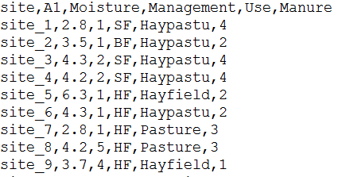

Opening data with readr
========================================================
author: 
date: 
autosize: true
width: 1440
height: 900
<div align="center">

</div>


What is readr? 
========================================================
incremental: true
Package for reading flat files into R

Benefits over read.csv / read.fwf:
* Fast for big files
* Doesn't force strings into factors
* Lets you specify the type of data in each column
* Creates "tibbles" instead of simple data frames


```r
library(readr)
```


A simple example
========================================================
Dune species data
<div align="center">

</div>

***

Dune environmental data
<div align="center">

</div>

A simple example
========================================================


```r
dune_sp = read_csv("data/dune.csv")
```

```
Parsed with column specification:
cols(
  .default = col_integer(),
  site = col_character()
)
```

```
See spec(...) for full column specifications.
```

```r
dune_env = read_csv("data/dune.env.csv")
```

```
Parsed with column specification:
cols(
  site = col_character(),
  A1 = col_double(),
  Moisture = col_integer(),
  Management = col_character(),
  Use = col_character(),
  Manure = col_integer()
)
```


A simple example
========================================================
incremental:true


```r
head(dune_sp) 
```

```
# A tibble: 6 x 31
    site Achimill Agrostol Airaprae Alopgeni Anthodor Bellpere Bromhord
   <chr>    <int>    <int>    <int>    <int>    <int>    <int>    <int>
1 site_1        1        0        0        0        0        0        0
2 site_2        3        0        0        2        0        3        4
3 site_3        0        4        0        7        0        2        0
4 site_4        0        8        0        2        0        2        3
5 site_5        2        0        0        0        4        2        2
6 site_6        2        0        0        0        3        0        0
# ... with 23 more variables: Chenalbu <int>, Cirsarve <int>,
#   Comapalu <int>, Eleopalu <int>, Elymrepe <int>, Empenigr <int>,
#   Hyporadi <int>, Juncarti <int>, Juncbufo <int>, Lolipere <int>,
#   Planlanc <int>, Poaprat <int>, Poatriv <int>, Ranuflam <int>,
#   Rumeacet <int>, Sagiproc <int>, Salirepe <int>, Scorautu <int>,
#   Trifprat <int>, Trifrepe <int>, Vicilath <int>, Bracruta <int>,
#   Callcusp <int>
```


A simple example
========================================================


```r
head(dune_env)
```

```
# A tibble: 6 x 6
    site    A1 Moisture Management      Use Manure
   <chr> <dbl>    <int>      <chr>    <chr>  <int>
1 site_1   2.8        1         SF Haypastu      4
2 site_2   3.5        1         BF Haypastu      2
3 site_3   4.3        2         SF Haypastu      4
4 site_4   4.2        2         SF Haypastu      4
5 site_5   6.3        1         HF Hayfield      2
6 site_6   4.3        1         HF Haypastu      2
```


Exercise:
=======================================================

In the data folder there are two data files:
* trawl_abiotic.csv
* trawl_biomass.csv


### For these two data files:

1. Load the data as `trawl_abiotic` and `trawl_sp_biomass` using `readr`
2. Identify the column types
3. Identify any issues loading with loading this data


Dealing with data types with readr
========================================
incremental: true


* By default `readr` looks at the start of the data to figure out types
* Errors come from wrong guesses
* You can increase the number of rows used to guess:


```r
dune_env = read_csv("data/dune.env.csv",
                         guess_max=5000)
```


* Generally best to specify column types yourself: 


```r
dune_env = read_csv("data/dune.env.csv",
                         col_types = cols(Moisture = "d"))
```


Dealing with data types with readr
========================================
Type abbreviations:

* `"c"`: character (e.g. "abc")
* `"i"`: integer (e.g. 1,2,3)
* `"d"`: double (e.g. 1.2, 2.3, 3)
* `"l"`: logical (TRUE or FALSE) 
* `"D"`: dates (e.g. "2017-09-26", "02-05-1995")


Exercise:
=======================================================

Try loading the trawl abiotic dataset again by:

1. Increasing the number of columns read in
2. Specifying depth as a "double" instead of an integer


Other useful options for readr:
=====================================
incremental: true
Specifying NA values:


```r
dune_env = read_csv("data/dune.env.csv",
                         na = c("NA","."))
```

Opening other types of data:

* `read_fwf` to read fixed width files
* `read_tsf` for tab-seperated files
* `read_delim` for other seperators
* see `?readr` of other types
